# DICOM Toolkit App

[](https://fastapi.tiangolo.com/)
[](https://nextjs.org/)
[](https://ohif.org/)
[](https://www.dicomstandard.org/using/dicomweb)
[](https://www.postgresql.org/)
[](https://docs.docker.com/compose/)
[](LICENSE)

A production-oriented medical imaging workflow platform for ingesting, converting, de-identifying, cataloging, and viewing DICOM studies with a modern Next.js application shell, a FastAPI control plane, Orthanc DICOMweb archive integration, background processing workers, and the latest stable OHIF viewer.

> This project is an engineering toolkit for medical-imaging workflows. It is not, by itself, a certified medical device, PACS, diagnostic workstation, or HIPAA compliance program. Production use with PHI requires proper security review, operational controls, validation, and regulatory assessment.

## Contents

- [What This App Does](#what-this-app-does)
- [App UI](#app-ui)
- [Architecture](#architecture)
- [Repository Layout](#repository-layout)
- [Core Workflows](#core-workflows)
- [Local Development](#local-development)
- [Publishing As A New Monorepo](#publishing-as-a-new-monorepo)
- [Configuration](#configuration)
- [API Surface](#api-surface)
- [OHIF Viewer Integration](#ohif-viewer-integration)
- [Background Jobs](#background-jobs)
- [Testing And Validation](#testing-and-validation)
- [Production Readiness Checklist](#production-readiness-checklist)
- [Troubleshooting](#troubleshooting)

## What This App Does

DICOM Toolkit App turns several medical-imaging tasks into one clean workflow:

- Upload and inspect DICOM studies.
- Convert DICOM images to export formats such as PNG/JPEG/PDF where supported.
- Convert non-DICOM media into DICOM objects.
- Ingest `.mime` and `.eml` payloads, extract DICOM attachments, optionally wrap supported image attachments as Secondary Capture DICOM, and make results available for viewing or download.
- De-identify DICOM files and keep structured audit records.
- Catalog studies through a normalized worklist API.
- Launch studies in OHIF for CT, MR, X-ray, ultrasound, secondary capture, and other DICOM modalities supported by the archive/viewer stack.
- Run heavier processing through background jobs instead of blocking the web request.
- Keep DICOM storage and DICOMweb serving in a dedicated archive plane rather than making the Python API behave like a PACS.

## App UI

| Home | Dashboard |
| --- | --- |
| 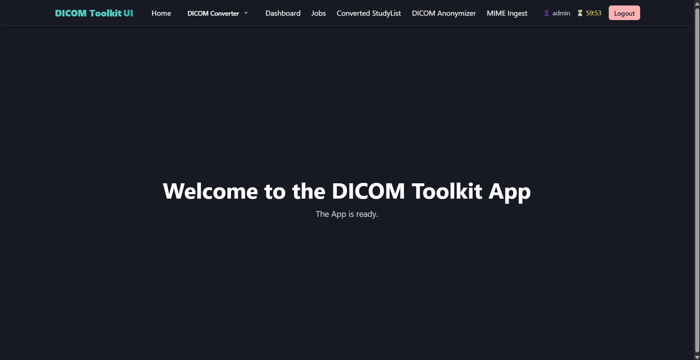 | 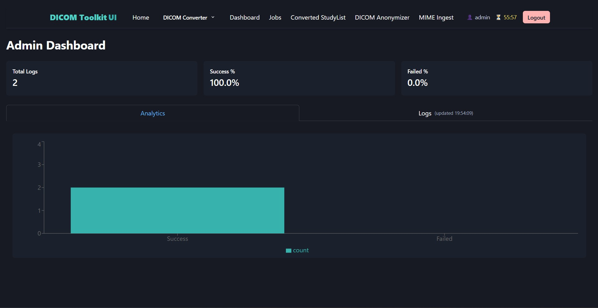 |

| Convert To DICOM | MIME Ingest |
| --- | --- |
| 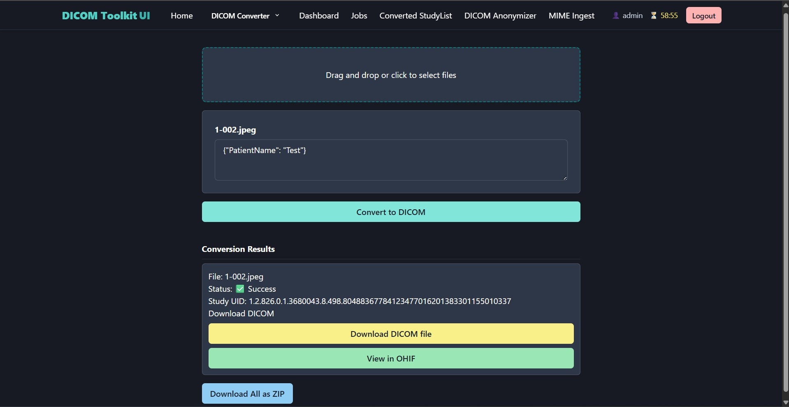 | 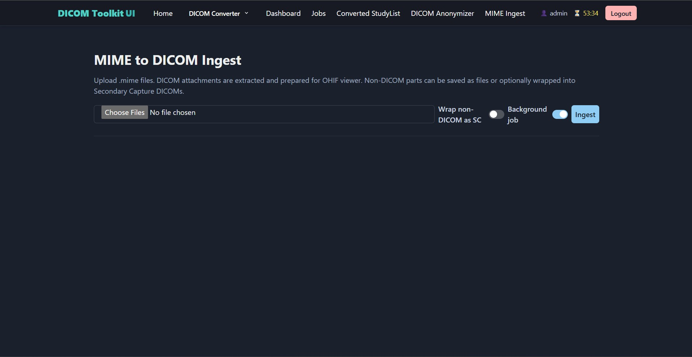 |

| Anonymization | OHIF Viewer |
| --- | --- |
| 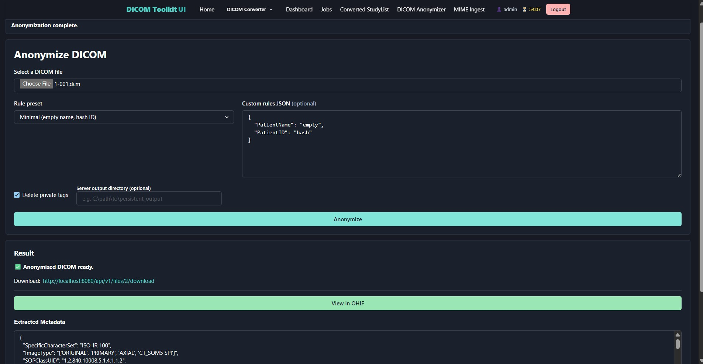 | 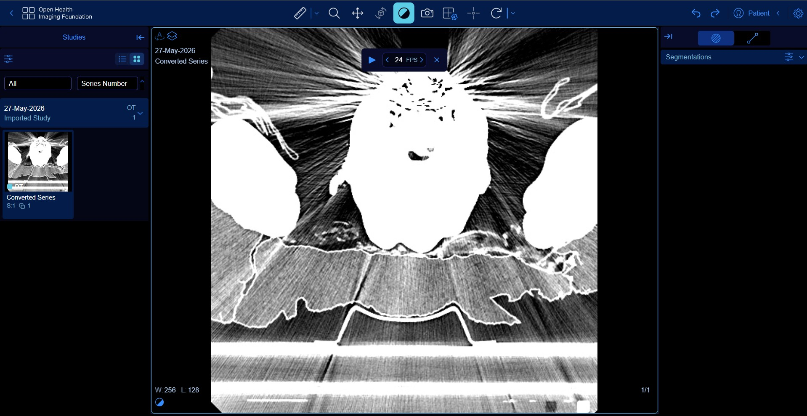 |


## Architecture

The refreshed architecture separates the app into four clear planes:

- **Web application shell**: Next.js and Chakra UI for workflow screens, uploads, conversions, jobs, studies, auth, and admin views.
- **API/control plane**: FastAPI for authentication, orchestration, normalized APIs, audit logging, de-identification, conversions, and job management.
- **Imaging archive plane**: Orthanc with DICOMweb for DICOM object storage and standards-oriented retrieval.
- **Worker/processing plane**: Python worker process for async MIME ingest and conversion jobs.

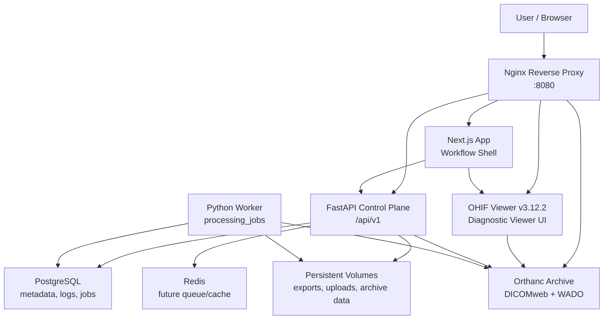

### Request Routing

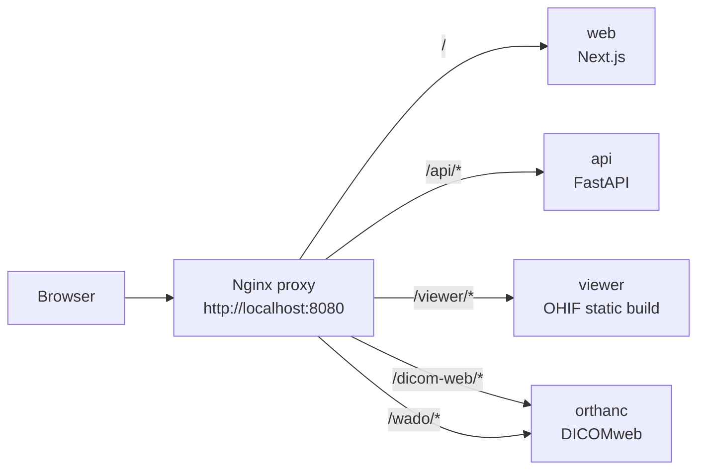

### Deployment Topology

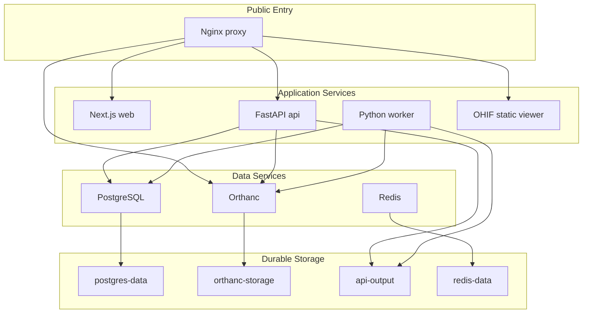

## Repository Layout

```text
.
|-- backend/                 FastAPI API, domain services, DB models, workers
|   |-- app/api/v1/           Clean versioned API routers
|   |-- app/domain/           Conversion, de-id, jobs, MIME, files, studies
|   |-- app/infrastructure/   Archive clients and external integrations
|   |-- app/workers/          Background job worker
|   |-- alembic/              Database migrations
|   `-- tests/                Backend tests
|-- frontend/                Next.js + Chakra workflow application
|   |-- pages/                App pages
|   |-- components/           Shared UI components
|   `-- src/utils/            API, auth, and environment helpers
|-- infra/
|   |-- nginx/                Reverse proxy configuration
|   |-- orthanc/              Orthanc/DICOMweb configuration
|   `-- viewer/               OHIF runtime app-config.js
|-- scripts/
|   |-- build-ohif.ps1        Fetches pinned OHIF and creates .runtime/ohif-dist
|   `-- start-local.ps1       Builds viewer if needed and starts Compose
|-- docker-compose.yml       Full local architecture stack
|-- .external/                Ignored upstream OHIF source checkout
`-- .runtime/ohif-dist        Ignored built OHIF static assets
```

## Core Workflows

### Study Viewing

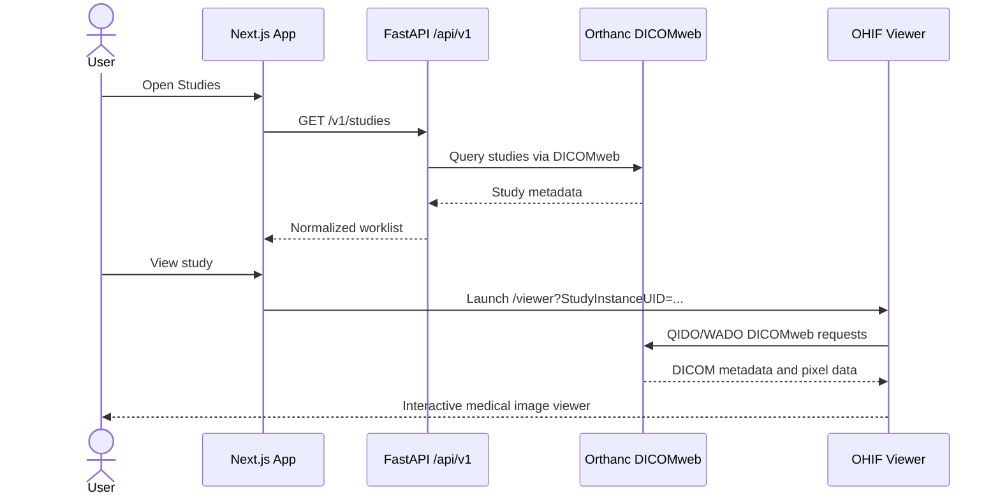

### MIME Ingest As A Background Job

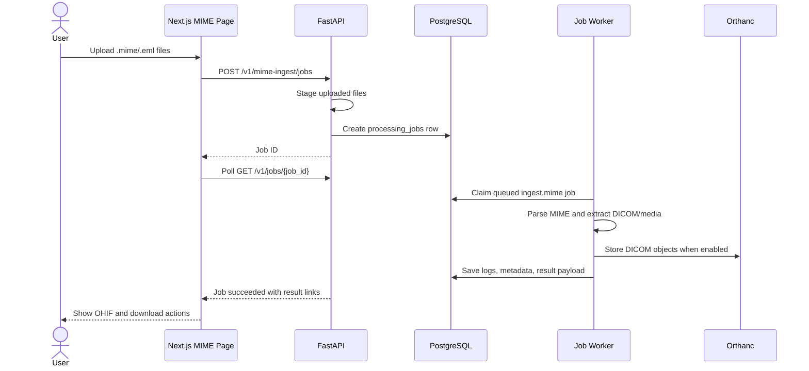

### DICOM Export Conversion

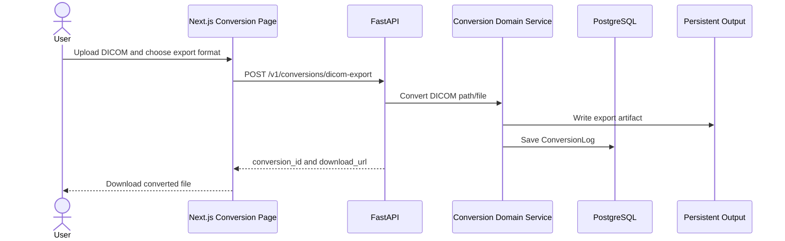

### De-identification

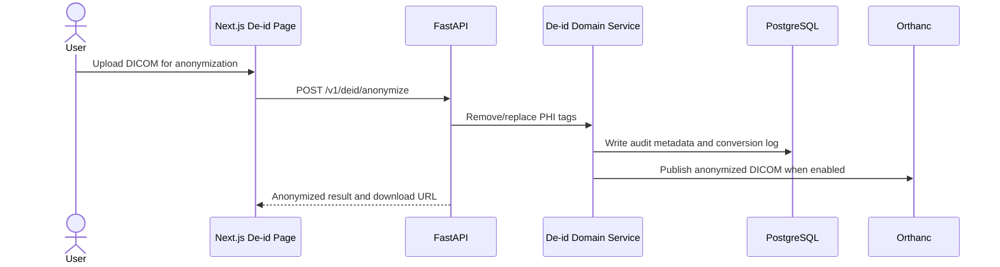

## Local Development

### Prerequisites

- Docker Desktop with Compose
- Node.js 20+
- Python 3.11+ recommended for backend development
- Yarn and Bun for rebuilding OHIF
- Git

### Clone

```bash
git clone https://github.com/<your-org>/<your-new-repo>.git
cd <your-new-repo>
```

### Build OHIF

The repository does not commit upstream OHIF source or generated viewer assets. The build script fetches official OHIF `v3.12.2` into ignored `.external/ohif-viewer`, builds it, then copies the static viewer into ignored `.runtime/ohif-dist`.

Build it before starting the stack. On Windows:

```powershell
.\scripts\build-ohif.ps1
```

The current OHIF build is pinned to upstream stable `v3.12.2`.

### Start The Full Stack

On Windows, the helper script builds OHIF if needed and starts the stack:

```powershell
.\scripts\start-local.ps1
```

Or run Compose directly:

```bash
docker compose up -d --build
```

Open:

| Surface | URL |
| --- | --- |
| App shell | `http://localhost:8080` |
| API | `http://localhost:8080/api/v1` |
| API health | `http://localhost:8080/api/v1/health/live` |
| OHIF viewer | `http://localhost:8080/viewer` |
| OHIF local file loader | `http://localhost:8080/viewer/local` |
| DICOMweb | `http://localhost:8080/dicom-web` |
| WADO-URI | `http://localhost:8080/wado` |

### Stop The Stack

```bash
docker compose down
```

To remove local databases and stored imaging artifacts:

```bash
docker compose down -v
```

Use volume deletion carefully. Local DICOM/archive data will be removed.

## Publishing As A New Monorepo

This workspace was assembled from three original repositories. It is now shaped as one root monorepo; the old nested `.git` directories should not be present before the first push.

### 1. Preserve Existing Work

If the original repositories contain history you want to keep, push them or back them up first.

### 2. Create The First Commit

Initialize the new root repository if it has not already been initialized, then create the first commit:

```bash
git init
git add .
git commit -m "Initial monorepo import"
git branch -M main
git remote add origin https://github.com/<your-org>/<your-new-repo>.git
git push -u origin main
```

### 3. Review Before First Push

Run:

```bash
git status --short
git diff --cached --stat
```

Confirm that generated builds, local uploads, DICOM files, `.env` files, database volumes, and PHI-containing artifacts are not staged.

## Configuration

The compose file provides a working local setup. For production, configure secrets and URLs through environment variables or your deployment platform.

### Backend

| Variable | Purpose | Local default |
| --- | --- | --- |
| `BASE_URL` | Public API base URL used to generate links | `http://localhost:8080/api` |
| `OHIF_PUBLIC_URL` | Public OHIF base URL used for viewer links | `http://localhost:8080/viewer` |
| `DATABASE_URL` | Async SQLAlchemy PostgreSQL URL | `postgresql+asyncpg://...` |
| `PERSISTENT_OUTPUT_DIR` | Output/upload working directory | `/app/persistent_output` |
| `OHIF_VIEWER_DIR` | Internal working directory for generated viewer-compatible artifacts | `/app/ohif` |
| `DICOM_ARCHIVE_ENABLED` | Enables archive publishing | `true` |
| `DICOM_ARCHIVE_DICOMWEB_URL` | Archive DICOMweb root | `http://orthanc:8042/dicom-web` |
| `DICOM_ARCHIVE_STOW_URL` | Archive STOW-RS endpoint | `http://orthanc:8042/dicom-web/studies` |
| `CORS_ORIGINS` | Allowed frontend origins | `http://localhost:8080,...` |
| `JWT_SECRET_KEY` | Token signing secret | set in deployment |
| `API_KEYS` | Optional API key list | set in deployment |

See `backend/.env.example` for backend-specific examples.

### Frontend

| Variable | Purpose | Local default |
| --- | --- | --- |
| `NEXT_PUBLIC_API_BASE_URL` | Public API prefix without `/v1` | `http://localhost:8080/api` |
| `NEXT_PUBLIC_OHIF_BASE_URL` | Public OHIF viewer URL | `http://localhost:8080/viewer` |

The frontend centralizes these values in `frontend/src/utils/env.ts`.

### OHIF

OHIF runtime configuration is injected by:

```text
infra/viewer/app-config.js
```

It points OHIF to Orthanc through the reverse proxy:

- QIDO-RS: `/dicom-web`
- WADO-RS: `/dicom-web`
- WADO-URI: `/wado`

## API Surface

Clean versioned APIs live under `/api/v1` through the reverse proxy.

| Area | Endpoint |
| --- | --- |
| Auth | `/v1/authenticator`, `/v1/auth/refresh` |
| Health | `/v1/healthcheck`, `/v1/health/live`, `/v1/health/ready` |
| Metrics | `/v1/metrics` |
| Admin | `/v1/admin/events` |
| Files | `/v1/files/*` |
| Archive | `/v1/archive/*` |
| Studies | `/v1/studies` |
| Jobs | `/v1/jobs`, `/v1/jobs/{job_id}` |
| Conversions | `/v1/conversions/*` |
| De-identification | `/v1/deid/anonymize` |
| MIME ingest jobs | `/v1/mime-ingest/jobs` |
| Sync MIME ingest | `/v1/mime/ingest` |
| Local DICOMweb cache | `/v1/dicomweb/*` |

Legacy conversion and viewer compatibility routes have been removed. The app now uses the clean versioned endpoints and the OHIF viewer reads imaging data through Orthanc DICOMweb.

## OHIF Viewer Integration

The app shell does not try to be a second diagnostic viewer. It launches OHIF with study identifiers and lets OHIF retrieve imaging data from the archive.

For browser-local DICOM files, use the app's Local DICOM Viewer navigation item or open `/viewer/local` directly. OHIF can load selected `.dcm` files, selected folders, or drag-and-dropped files without uploading them to the API or Orthanc.

Viewer URLs are generated through:

```text
frontend/src/utils/env.ts
backend/app/utilities/url_helpers.py
```

This keeps launch links correct whether the app is running directly against FastAPI or behind `/api` in the reverse proxy.

## Background Jobs

The backend includes a database-backed job foundation:

- `processing_jobs` table
- `/v1/jobs` API
- `app/workers/job_worker.py`
- Jobs page in the frontend

Supported job handlers:

| Job type | Purpose |
| --- | --- |
| `health.ping` | Worker health check |
| `conversion.dicom_to_export` | Convert a staged DICOM file to an export format |
| `conversion.media_to_dicom` | Convert staged media into DICOM |
| `ingest.mime` | Process staged MIME uploads |

Example payload:

```json
{
  "job_type": "conversion.dicom_to_export",
  "input_payload": {
    "dicom_path": "/app/persistent_output/studies/example/series/instance.dcm",
    "format": "png",
    "output_dir": "/app/persistent_output/exports",
    "quality": 95,
    "download_base_url": "/v1"
  },
  "priority": 100
}
```

## Testing And Validation

### Backend

```bash
cd backend
python -m compileall app config alembic tests
python -m pytest tests
```

### Frontend

```bash
cd frontend
npm install
npm run build
```

### OHIF

```bash
.\scripts\build-ohif.ps1
```

### Compose Config

```bash
docker compose config --quiet
```

### Runtime Smoke Test

```bash
docker compose up -d --build
docker compose ps
```

Then verify:

- App shell loads at `http://localhost:8080`.
- API live health returns OK.
- OHIF loads at `/viewer`.
- Orthanc DICOMweb responds through `/dicom-web`.
- MIME ingest can queue a background job.
- Jobs page shows the job moving from queued/running to succeeded or failed.
- A study can be launched in OHIF from the Studies page.

## Production Readiness Checklist

Before handling real PHI or production clinical workflows:

- Replace demo credentials and local secrets.
- Add HTTPS/TLS termination.
- Use a managed PostgreSQL backup and retention policy.
- Configure archive persistence, backup, and restore procedures.
- Add real identity provider integration and role-based authorization.
- Review token storage and session management for the target threat model.
- Enable structured application logs and centralized audit logging.
- Add PHI-safe logging filters.
- Add malware/file validation policy for uploads.
- Add rate limiting and request size limits.
- Add full integration tests against a representative DICOM corpus.
- Validate supported modalities, transfer syntaxes, and pixel codecs.
- Define de-identification profiles and QA procedures.
- Perform security, privacy, and regulatory review before clinical use.

See [docs/PRODUCTION_CHECKLIST.md](docs/PRODUCTION_CHECKLIST.md) for the fuller release checklist.
See [docs/OHIF_STRATEGY.md](docs/OHIF_STRATEGY.md) for the viewer dependency strategy.

## Troubleshooting

### Docker Daemon Is Not Available

If `docker compose ps` fails on Windows with a pipe error such as `dockerDesktopLinuxEngine` or `docker_engine` not found, start Docker Desktop and wait until the Linux engine is running.

### OHIF Shows No Studies

Check:

- `.runtime/ohif-dist/index.html` exists.
- `infra/viewer/app-config.js` points to `/dicom-web`.
- Orthanc is running.
- The study was stored in Orthanc.
- Browser devtools show successful QIDO/WADO requests.

### Generated Links Point To The Wrong Host

Check:

- Backend `BASE_URL`
- Backend `OHIF_PUBLIC_URL`
- Frontend `NEXT_PUBLIC_API_BASE_URL`
- Frontend `NEXT_PUBLIC_OHIF_BASE_URL`

### MIME Jobs Stay Queued

Check:

- The `worker` container is running.
- The API and worker share the same `DATABASE_URL`.
- The API and worker share the same `api-output` volume.
- `processing_jobs` contains the queued job.

## Roadmap

- Split the large MIME ingestion service into smaller parser, writer, persistence, and archive-publishing modules.
- Expand integration tests around Orthanc, OHIF launch URLs, de-identification, MIME ingest, and conversion jobs.
- Replace local-development auth defaults with organization-specific identity provider integration before production PHI use.
- Add deployment-specific infrastructure modules for the chosen cloud or on-prem runtime.

## License

This project is licensed under the [MIT License](LICENSE).
